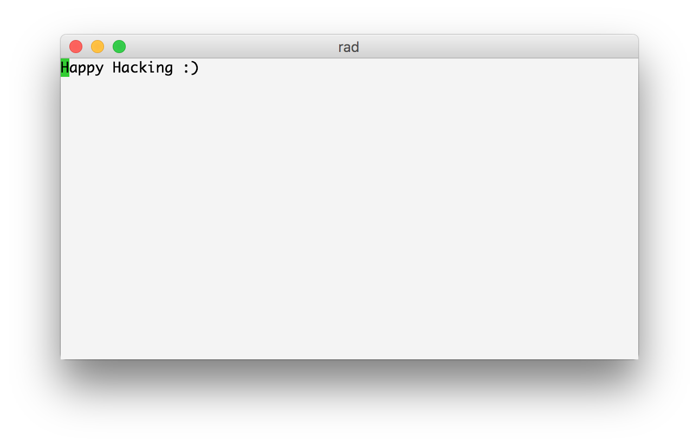

# Rad packages

Rad packages are the premier way to extend the rad editor. Since Rad is written in a lispy language, extending it is crazy simple.

Let's create our very own package.


## Tutorial - a very happy and pleasant package
We will begin my making a package, that adds a command. When the package is loaded, running the command `!happy` will replace your current buffer with a happy message.

1. Ensure there is a directory `.rad/packages` in your home (in unix, `$ mkdir -p ~/.rad/packages/replace_buffer_with_happy_message`)
2. Open a new file at `~/.rad/packages/replace_buffer_with_happy_message/replace_buffer_with_happy_message.clj`. The placement inside `.rad/packages` doesn't matter, but I like to have one dir per package. Nice if you need more than one file.
3. Enter the `ns` declaration, which also declares a package. Also enter any functions you want to use from your commands.
``` clojure
(ns replace-buffer-with-happy-message
  "Replaces the current buffers content with an uplifting message.
  Just for fun."
  {:author {:name "Martin Josefsson"
            :url "http://www.martinjosefsson.com"
            :email "hello@martinjosefsson.com"}
   :command-map '{\!
                  {\h
                   {\a
                    {\p
                     {\p
                      {\y
                       (fn [] (reset! rad.state/current-buffer ;; you can use any rad namespace, except for `rad.core`
                                (replace-buffer-with-happy-message/message)))}}}}}}})

(println "Happy Hacking :)")
(defn message []
  (let [msg "Happy Hacking :)"]
    (println (str "Happy Hacking :)" msg))
    [msg]))
```
The attrubute `:command-map` is special in that `rad.mode/command-mode-handle-keypress!` will look there for commands. The other attributes are not used at the moment - but in general I copy the manifest of Node.js's `package.json`.
4. Save the file to disk
5. Either restart rad, or have it call `(rad.package/load-package-from-file! (str (System/getProperty "user.home") "/.rad/packages/replace_buffer_with_happy_message/replace_buffer_with_happy_message.clj"))`6. When the package is loaded, enter command mode and type the command `!happy`. Your buffer will now contain a happy greeting!


